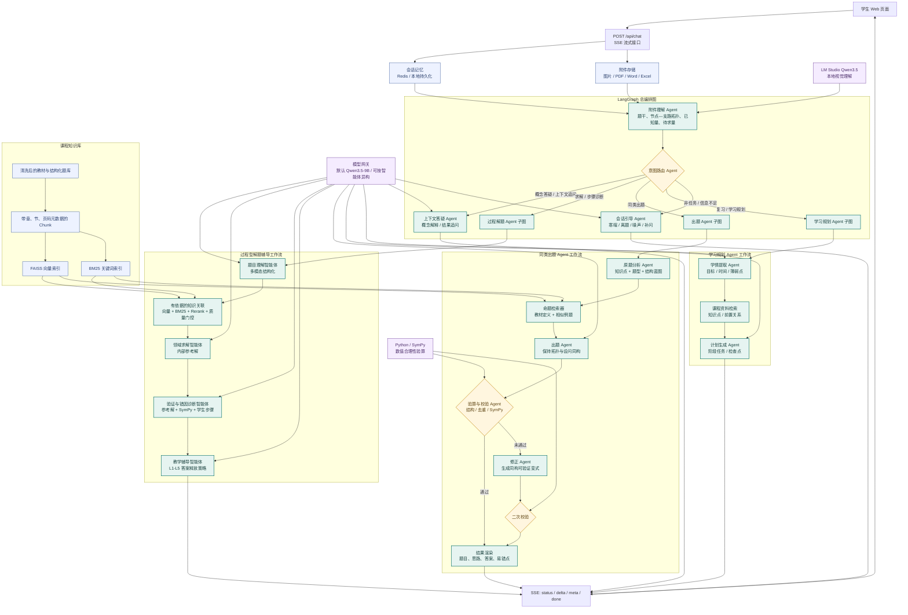

# CircuitMind LangGraph 多智能体工作流

本文档对应当前学生端的实际 LangGraph 编排。总图先结合最近对话与附件完成意图路由：概念答疑和上下文追问走轻量直答链路，明确的求解或步骤诊断才进入四智能体子图，同类出题进入独立出题子图，学习规划进入学情—资料—计划子图；寒暄、离题内容、噪声及不完整指令由会话引导链处理，不触发检索和解题。

## 关键状态流转

LangGraph 状态中主要保存以下信息：

- `message`、`history`、`knowledge_base`：学生输入、最近对话和当前知识库。
- `attachment_context`、`attachment_blueprint`：附件识别文本以及电路拓扑、已知量、待求量蓝图。
- `intent`：路由结果，取值为 `qa`、`answer`、`quiz`、`plan` 或 `chat`；只有 `answer` 执行完整解题链，`chat` 不检索课程资料也不改写题目状态。
- `problem_analysis`：题型、知识点、已知量、待求量、拓扑和信息完整性。
- `reference_solution`：仅在后端保存的内部方法、计划、检查点、推导和最终答案。
- `diagnosis`、`verification`：学生步骤的结构化错因与 SymPy 数值链校验。
- `tutor_action`、`hint_level`：当前教学动作以及 L1–L5 答案释放级别。
- `knowledge_point`、`quiz_type`、`quiz_family`：出题知识点、数值/概念题型和同构题家族。
- `plan_profile`：学习目标、可用时间、薄弱知识点及计划约束。
- `draft`、`verification`：生成题草稿以及结构、去重和 SymPy 校验结果。
- `response`、`sources`：最终回复和可追溯资料来源。
