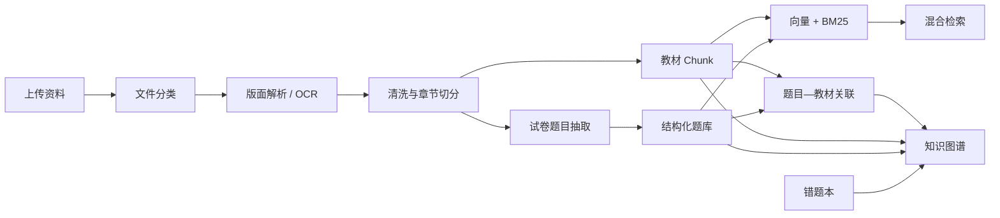

# 知识库构建与数据格式

CircuitMind 将教材、试卷、题库和学生错题组织为相互关联的课程知识空间。知识库的目标不是让模型“记住整本书”，而是在回答或诊断时提供可定位、可复核的教学证据。

## 支持的输入

| 类型 | 常见用途 | 处理方式 |
|---|---|---|
| PDF | 教材、讲义、试卷 | PyMuPDF；低文本覆盖率时使用 OCR |
| DOCX | 讲义、习题解析 | `python-docx` |
| Markdown / TXT | 已清洗教学内容 | 保留标题层级并切分 |
| XLSX | 结构化题库 | `openpyxl` 读取字段 |
| JSON | 已有题库或课程数据 | 按结构化记录导入 |

结构化 Excel 题库至少需要以下列：

```text
题号
题目文本
知识点标签
标准答案
易错点
```

推荐补充：

```text
难度
题型
解题步骤
替代解法
提示等级
```

## 构建流水线



构建命令：

```bash
.venv/bin/python scripts/build_knowledge_base.py --full
```

指定知识库：

```bash
.venv/bin/python scripts/build_knowledge_base.py \
  --knowledge-base circuits-101 \
  --full
```

也可以通过 `/api/kb/ingest` 批量上传；后端会在本批文件全部写入后只重建一次索引。

## PDF 与 OCR

系统首先尝试 PyMuPDF 原生文本提取。如果有效文本覆盖率较低，则将 PDF 标记为扫描版。

macOS 上可通过 `PDF_LOCAL_OCR=auto` 使用系统 Vision OCR。其他平台或公式、版面要求更高的资料，可配置：

```dotenv
PDF_EXTRACTOR_URL=http://127.0.0.1:9000/extract
```

外部解析器接收 multipart 字段 `file`，推荐返回：

```json
{
  "parser": "mineru",
  "pages": [
    {
      "page": 1,
      "markdown": "# 第一章……",
      "chapter": "第一章 电路基础",
      "section": "1.1 基本变量"
    }
  ]
}
```

`markdown` 也可以替换为 `text`。解析服务不可用、返回错误或内容为空时，系统会回退到本地解析，并在来源清单中记录警告。

解析缓存位于 `data/vector_stores/.extraction_cache/`。缓存键包含文件路径、大小、修改时间、解析器配置和缓存版本，避免只新增一份资料时重复 OCR 全部教材。

## 数据产物

每个知识库位于 `data/vector_stores/<knowledge-base>/`：

```text
cleaned_documents/       清洗后的文档，仅用于本地构建和复核
chunks.jsonl             教材与题库切片
question_bank.json       结构化题目
knowledge_relations.jsonl
                         题目 supported_by 教材的关系
source_manifest.json     来源、解析器、警告和构建状态
vectors.faiss            向量索引
index_meta.json          索引统计与构建元数据
```

这些文件可能包含教材原文或其可恢复表示。除非拥有明确再分发权，否则不要将自己的构建产物提交到公共仓库。

## 检索策略

检索同时使用：

1. 向量语义相似度；
2. BM25 关键词得分；
3. 章节、题型和知识点元数据；
4. 规则重排与最低分阈值；
5. 相同来源、相同页片段去重。

学生端引用采取“证据不足则不展示”的策略。以下情况返回空来源而不是弱相关材料：

- 尚无完整题目或明确知识点；
- 题目理解置信度过低；
- 模型给出的知识点在题干、拓扑、已知量和待求量中找不到证据；
- 检索分数未达到最低阈值。

## 知识图谱

知识图谱不是独立的图数据库，而是从当前知识库产物实时聚合的可移植视图。节点包含：

- 课程分类与知识点名称；
- 经质量检查的概念定义和知识要点；
- 教材来源、章节和页码；
- 相关题目；
- 按知识点关联的错题记录。

“其他知识”固定排在课程分类末尾。用户可见正文不会直接照搬原始切片：系统会过滤页码、图号、版面说明、异常符号密度、乱码和残缺公式。对于叠加定理、KCL、KVL、欧姆定律等基础概念，可在 `backend/app/services/validated_knowledge.py` 中维护经审核的定义卡片。

## 质量检查建议

每批资料导入后至少抽查：

- 章节标题和 PDF 页码是否对齐；
- 公式是否保持有效 LaTeX；
- 电路图引用是否缺少图片；
- 试卷是否发生跨题粘连；
- 同一题目的标准答案与教材依据是否一致；
- 知识图谱节点是否出现 OCR 乱码；
- 检索 Top-k 是否来自多个合理来源，而非单本教材垄断。
